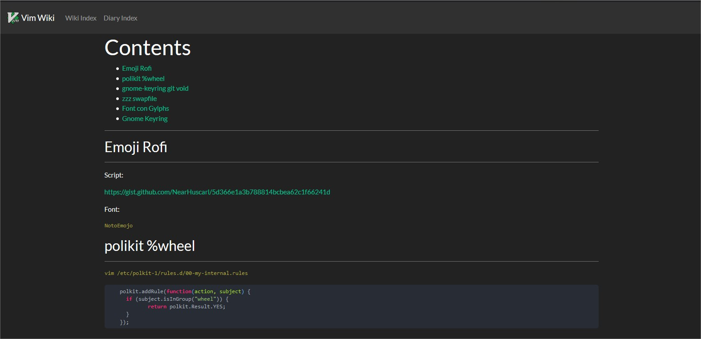

This is my Vim Wiki template.

It uses:

- [highlight.js](https://highlightjs.org/) for code syntax
- [Math Ajax](https://www.mathjax.org/) for latex formulas
- [bootstrap](https://getbootstrap.com/) Making thigs prettier
- [jquery](https://jquery.com/)

My vimrc:

```vim
let g:vimwiki_list = [{'path': '$HOME/vimwiki',
		  \ 'path_html': '$HOME/vimwiki/wiki_html/',
		  \ 'template_path': '$HOME/vimwiki/templates',
		  \ 'template_default': 'def_template',
		  \ 'auto_toc': 1,
		  \ 'template_ext': '.html'}]

autocmd FileType vimwiki inoremap <F5> <Esc>:VimwikiAll2HTML<Enter>
autocmd FileType vimwiki nnoremap <F5> :VimwikiAll2HTML<Enter>
```


